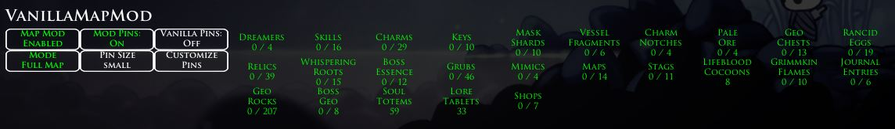

# VanillaMapMod

VanillaMapMod is a Hollow Knight mod that adds extra pins for all item locations on the map. Works on any save file.

# Dependencies
- [MapChanger](https://github.com/syyePhenomenol/MapChanger)
- [MagicUI](https://github.com/BadMagic100/HollowKnight.MagicUI)
- [ConnectionMetadataInjector](https://github.com/BadMagic100/ConnectionMetadataInjector)

Please make sure all of the dependent mods are installed and up to date.

Optional and compatible:
- [AdditionalMaps](https://github.com/SFGrenade/AdditionalMaps). Adds pins to white palace and godhome maps

# Screenshots

Click to expand

    
    

# Quick Start Guide
- Press `CTRL-M` during a game to enable the mod. Alternatively, click the red button when the game is paused.

# Features
## Hotkeys
- ``CTRL-M``: Toggle map enabled/disabled
- ``CTRL-T``: Toggle map mode

## Pause Menu
- "Map Mod Enabled/Disabled" `CTRL-M`: Toggle the mod on/off
- "Mode": Toggle the map mode
    - "Normal": Adds new pins over the existing map
    - "Full Map": Shows all pins and the full map regardless of progression
- "Mod Pins": Toggles the new pins on/off.
- "Vanilla Pins": Toggles the game's existing pins on/off.
- "Pin Shape": Toggles the shape of the new pins.
- "Pin Size": Toggles the size of the new pins.
- "Customize Pins": Toggle each pool on/off.
- "Fast Map Update (Normal Mode only)": When enabled and you have Quill, your map will update as soon as you enter a new room.
- "UI Scale": Change the scaling of UI text and buttons.

# How To Install
Use Scarab: https://github.com/fifty-six/Scarab

Or, you can install manually:
1. Download the latest release of `VanillaMapMod.zip`.
2. Unzip and copy the folder 'VanillaMapMod' to `...\hollow_knight_Data\Managed\Mods`.
