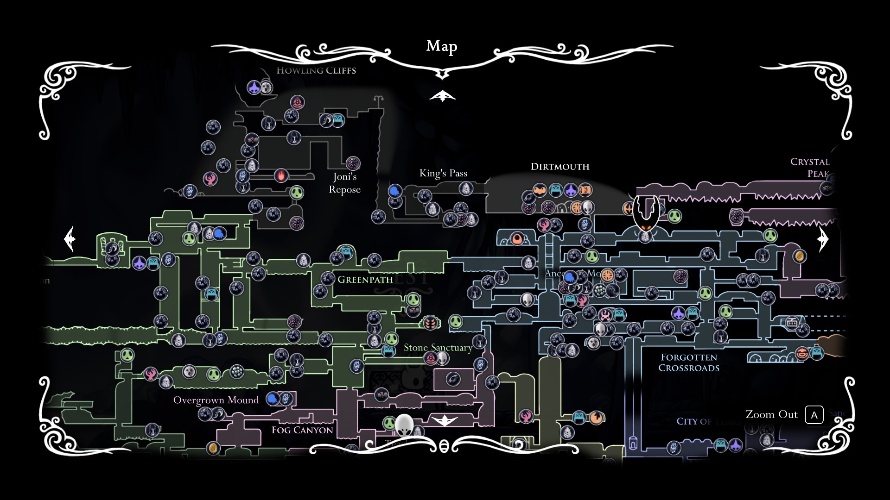
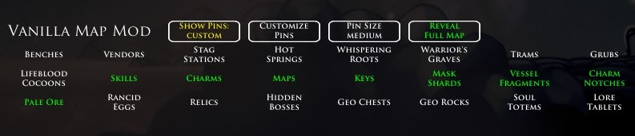

# Vanilla Map Mod
Vanilla Map Mod is a Hollow Knight mod that adds much more stuff to the existing World Map/Quick Map.

This is essentially RandoMapMod for the non-randomized experience.

# Quick Start Guide
If you want the complete Map with all locations, then click "Reveal Full Map" in the Pause Menu. You can untoggle at any time to go back to your current progress Map.

# Full Features
- In addition to the existing Pins in Hollow Knight, there are new Pins for:
    - Major progression items/skills
    - Charms
    - Maps (Cornifer locations)
    - Keys
    - Mask Shards
    - Vessel Fragments
    - Charm Notches
    - Pale Ore
    - Rancid Eggs
    - Relics
    - Hidden Bosses
    - Geo Chests
    - Geo Rocks
    - Soul Totems
    - Lore Tablets
    - The Grimm Troupe lantern

- You can buy the new Pins from Iselda as part of your game progression.
- The World Map/Quick Map will show all the new Pins that you have bought.
- Every item you pick up gets tracked by this mod, so Pins disappear as you acquire said items.

- The Pause Menu UI has the following buttons:
    - "Show Pins": Toggle all Pins on/off
    - "Customize Pins": Opens a panel to choose which Pins to show/hide (also includes Pins already in un-modded Hollow Knight)
    - "Pin Size": Adjust the size of the Pins between small/medium/large
    - "Reveal Full Map": Toggle Full Map with everything on/off

- As long as you have Quill, your map will be up to date as soon as you enter a new room.
- The "Map Updated" animation no longer occurs when sitting at a bench.
- You can install the mod for an existing save and there will be no conflicts, nor will it change your save.

- As of v1.0.2, VanillaMapMod is also fully compatible with AdditionalMaps.

# How To Install
Use Scarab: https://github.com/fifty-six/Scarab

Or, you can install manually:
1. Make sure you have Hollow Knight version 1.5.x, along with the latest versions of Modding API and Vasi.
2. Download the latest release of `VanillaMapMod.zip`.
3. Unzip and copy the folder 'VanillaMapMod' to `...\Steam\steamapps\common\Hollow Knight\hollow_knight_Data\Managed\Mods`.

# Acknowledgements
- The Hollow Knight/Hollow Knight Speedrun Discord Channels for always giving very sound advice and suggestions.
- CaptainDapper for making RandoMapMod, which much of this mod is derived from.
